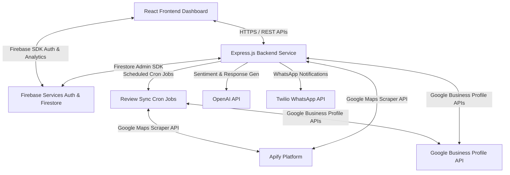
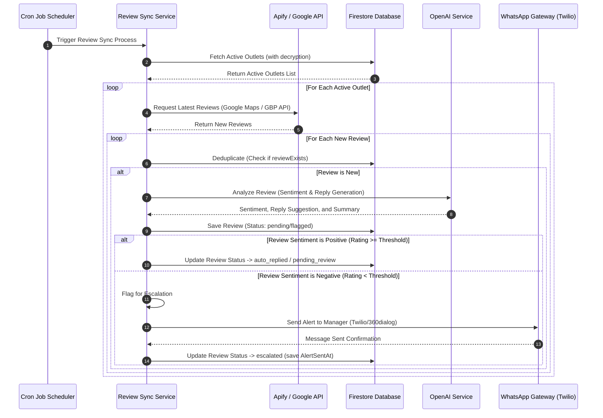

# System Architecture - Restaurant AI Review Automation

This document provides a comprehensive overview of the architecture, components, and data flows of the **Restaurant AI Review Automation** platform.

---

## 1. High-Level System Architecture

The platform follows a modern, decoupled client-server architecture. It integrates with external services (Firebase, Google Business Profile API, OpenAI API, Twilio API, and Apify Scraper API) to ingest, process, respond to, and escalate customer reviews.

---

## 2. Core Components

### A. Frontend Dashboard (`/frontend`)
*   **Vite + React (v19):** Single Page Application offering instant loading times and responsive rendering.
*   **Zustand:** Lightweight, centralized state management framework for user session state, outlet preferences, and dashboard UI configurations.
*   **React Query (@tanstack/react-query):** Manages server-state, handles request caching, background refetching, and automated state synchronization.
*   **Tailwind CSS + Framer Motion:** Implements a design system featuring dark modes, card elevations, smooth transitions, and high-fidelity micro-interactions.
*   **Firebase Client SDK:** Secures user authentication and provides direct, structured client login via OAuth (Sign in with Google).

### B. Backend Services API (`/backend`)
*   **Node.js & Express:** Lightweight, scalable REST API handling authentication, CRUD operations for outlets, dashboard telemetry, and webhook endpoints.
*   **Node-Cron Scheduler:** Orchestrates the periodic fetch pipeline running at configured periods (10:00 AM, 3:00 PM, and 9:00 PM).
*   **Repository Pattern:** Decouples API endpoints/services from database operations. Repositories (e.g., `outletRepo`, `reviewRepo`) act as data brokers for Firestore.
*   **Providers Layer:** Abstract interfaces handling external vendor communications (e.g., Twilio / 360dialog for WhatsApp, Apify for scraper actions).
*   **Firebase Admin SDK:** Direct administrative interface to Firestore, running queries, managing custom user tokens, and performing secure database mutations.

---

## 3. Data Processing Pipeline (Review Sync & Escalation)

The sequence diagram below details the data flow during a standard scheduled sync review cron job.

---

## 4. Security & Cryptographic Safeguards

*   **Google OAuth Refresh Token Security:** Outlet Google refresh tokens are stored in Firestore using industry-standard **AES-256-CBC encryption**. They are only decrypted in-memory on the backend server when initiating direct requests to the Google Business Profile API.
*   **Secrets Isolation:** API keys, database credentials, encryption salts, and private keys are loaded strictly from the system environment (`.env`) and are never committed to source control or exposed to the frontend.
*   **Rate Limiting & Helmet:** Backend Express applications enforce strict API rate limiting (`express-rate-limit`) to prevent DDoS attacks, and use `helmet` headers to safeguard against typical web vulnerabilities.
*   **Firebase Auth Rules:** Access to Firestore data is guarded by client-side Firestore rules and server-side authentication validation middlewares.
