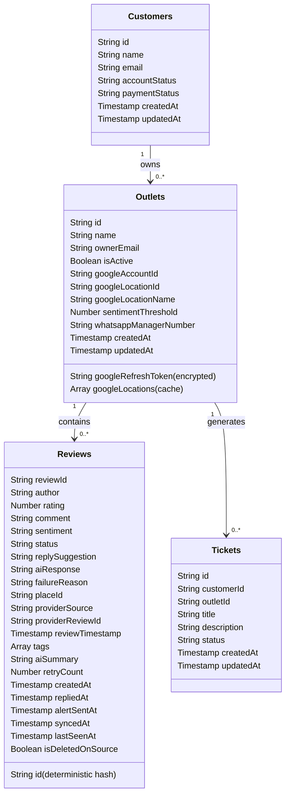

# Database Schema - Restaurant AI Review Automation

This document outlines the Firestore Database schema, collections, and document models utilized in the **Restaurant AI Review Automation** platform.

---

## Firestore Schema Design Overview

Firestore is a NoSQL, document-oriented database. The structure is based on collections containing documents, which in turn can contain subcollections or map structures.

---

## Collection Details & Document Structures

### 1. `customers`
Stores customer/organization accounts and subscription statuses.

*   **Document ID:** Auto-generated by Firestore.
*   **Fields:**
    | Field Name | Type | Description |
    | :--- | :--- | :--- |
    | `name` | String | Organization/Customer full name |
    | `email` | String | Registration & notification email address |
    | `accountStatus` | String | `'Active' \| 'Inactive' \| 'Trial'` |
    | `paymentStatus` | String | `'Pending' \| 'Paid' \| 'Unpaid'` |
    | `createdAt` | Timestamp | Server timestamp when the customer was created |
    | `updatedAt` | Timestamp | Server timestamp of the last update |

---

### 2. `outlets`
Stores specific restaurant outlet configurations, credentials, API tokens, and AI reply thresholds.

*   **Document ID:** Auto-generated by Firestore (or designated by API).
*   **Fields:**
    | Field Name | Type | Description |
    | :--- | :--- | :--- |
    | `name` | String | Display name of the restaurant branch |
    | `ownerEmail` | String | Email address of the outlet manager (used for OAuth check) |
    | `isActive` | Boolean | Activates or pauses review automation processing |
    | `googleRefreshToken` | String | **Encrypted** OAuth 2.0 refresh token for GMB API access |
    | `googleAccountId` | String | Google Business Profile API account identifier |
    | `googleLocationId` | String | Selected GMB Location ID for syncing reviews |
    | `googleLocationName` | String | Readable location name returned by GMB API |
    | `googleLocations` | Array | Cached list of all locations under the Google Account |
    | `sentimentThreshold` | Number | Star rating below which alerts are escalated (e.g. `4.0`) |
    | `whatsappManagerNumber` | String | WhatsApp number (with country code) to route escalations |
    | `createdAt` | Timestamp | Server timestamp when the outlet was registered |
    | `updatedAt` | Timestamp | Server timestamp of the last update |

---

### 3. `reviews`
Tracks customer reviews ingested from various platforms, sentiment classifications, AI-generated response proposals, and escalation metrics.

*   **Document ID:** Deterministic hash of review details (to prevent duplicates).
*   **Fields:**
    | Field Name | Type | Description |
    | :--- | :--- | :--- |
    | `reviewId` | String | Unique review identifier from source |
    | `author` | String | Author/customer profile name |
    | `rating` | Number | Star rating (1 to 5) |
    | `comment` | String | Review content text |
    | `sentiment` | String | Classified sentiment: `'positive' \| 'neutral' \| 'negative'` |
    | `status` | String | Current status: `'pending' \| 'replied' \| 'escalated' \| 'ignored'` |
    | `aiResponse` | String | The actual reply posted or recommended by the AI |
    | `replySuggestion` | String | Draft response generated initially by OpenAI |
    | `failureReason` | String | Details of any API failure (GMB post errors or Twilio timeout) |
    | `placeId` | String | Google Places API reference ID |
    | `providerSource` | String | Source engine (`'google_maps' \| 'apify' \| 'gmb_api'`) |
    | `providerReviewId` | String | Raw provider ID for mapping |
    | `reviewTimestamp` | Timestamp | Original timestamp when the review was written |
    | `tags` | Array (Strings) | AI-derived categories (`['service', 'food_quality']`) |
    | `aiSummary` | String | AI-generated summary of review contents |
    | `retryCount` | Number | Ingestion retry count |
    | `createdAt` | Timestamp | Ingest timestamp |
    | `repliedAt` | Timestamp | Timestamp when the response was posted |
    | `alertSentAt` | Timestamp | Timestamp when Twilio escalation was completed |
    | `isDeletedOnSource` | Boolean | True if the user deleted the review on Google |

---

### 4. `tickets`
Tracks escalated negative reviews requiring human intervention/manager action.

*   **Document ID:** Auto-generated.
*   **Fields:**
    | Field Name | Type | Description |
    | :--- | :--- | :--- |
    | `customerId` | String | Associated customer reference ID |
    | `outletId` | String | Associated outlet reference ID |
    | `title` | String | Auto-generated ticket title |
    | `description` | String | Negative review comment / escalation details |
    | `status` | String | `'Open' \| 'In_Progress' \| 'Resolved'` |
    | `createdAt` | Timestamp | Ticket opening timestamp |
    | `updatedAt` | Timestamp | Ticket status update timestamp |
